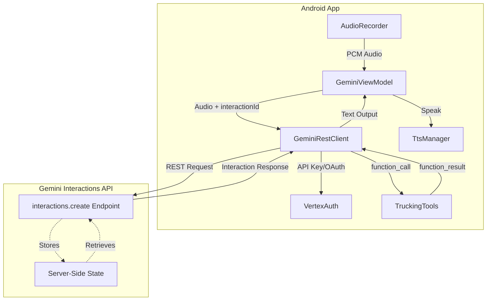
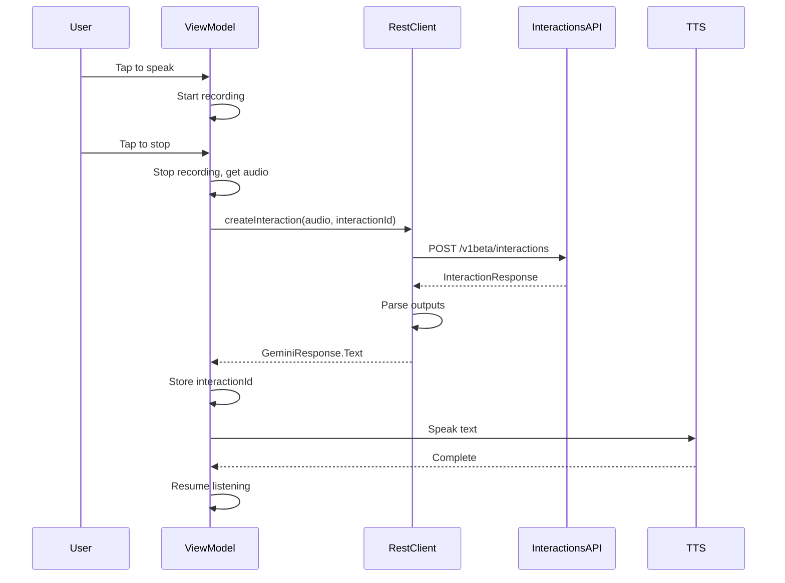
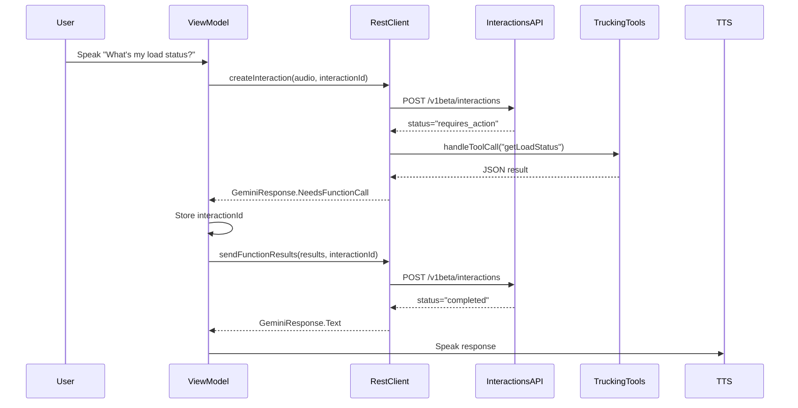
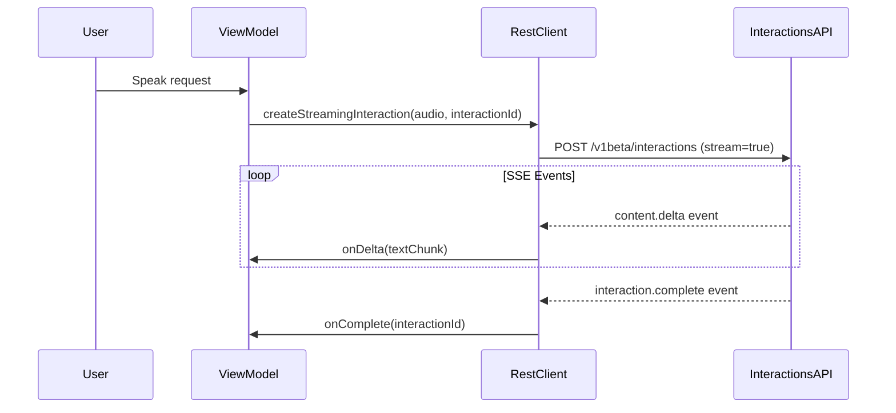

# Design Document: Gemini Interactions API Migration

## Overview

This document describes the technical design for migrating the GeminiLive Android trucking assistant app from the Vertex AI `generateContent` API to the new Gemini Interactions API. The migration leverages server-side conversation state management, simplifies client architecture, and maintains all existing trucking-specific functionality.

### Key Changes

1. **API Endpoint Migration**: From `streamGenerateContent` to `interactions.create`
2. **State Management**: Server-side via `previous_interaction_id` instead of client-side `conversationHistory`
3. **Authentication**: API key as primary method with OAuth2 fallback
4. **Response Format**: Parse `outputs` array with typed content blocks
5. **Function Calling**: Updated format with `function_call` and `function_result` output types

### Design Goals

- Eliminate client-side conversation history management
- Reduce memory overhead in the Android app
- Maintain backward compatibility with all 15 trucking tools
- Preserve existing UI states and user experience
- Support both streaming and non-streaming responses

---

## Architecture

### Current Architecture (generateContent)

```
┌─────────────────────────────────────────────────────────────────┐
│                        GeminiViewModel                          │
│  ┌─────────────────────────────────────────────────────────┐   │
│  │ conversationHistory: MutableList<ContentPart>           │   │
│  │  - Stores all text and audio from conversation          │   │
│  │  - Grows unbounded during session                       │   │
│  │  - Manually managed for role (user/model)               │   │
│  └─────────────────────────────────────────────────────────┘   │
│                              │                                   │
│                              ▼                                   │
│  ┌─────────────────────────────────────────────────────────┐   │
│  │ GeminiRestClient                                         │   │
│  │  - sendAudio(audio, token, history) → Response          │   │
│  │  - sendFunctionResults(calls, token, history, audio)    │   │
│  │  - Constructs full conversation in each request          │   │
│  └─────────────────────────────────────────────────────────┘   │
│                              │                                   │
│                              ▼                                   │
│  ┌─────────────────────────────────────────────────────────┐   │
│  │ Vertex AI streamGenerateContent                          │   │
│  │  - Endpoint: /publishers/google/models/gemini-2.5-pro   │   │
│  │  - Auth: OAuth2 Bearer token only                        │   │
│  │  - No server-side state                                  │   │
│  └─────────────────────────────────────────────────────────┘   │
└─────────────────────────────────────────────────────────────────┘
```

### Target Architecture (Interactions API)

```
┌─────────────────────────────────────────────────────────────────┐
│                        GeminiViewModel                          │
│  ┌─────────────────────────────────────────────────────────┐   │
│  │ interactionId: String?                                   │   │
│  │  - Single string stored per session                      │   │
│  │  - Cleared on session start/stop                         │   │
│  │  - Passed as previous_interaction_id                     │   │
│  └─────────────────────────────────────────────────────────┘   │
│                              │                                   │
│                              ▼                                   │
│  ┌─────────────────────────────────────────────────────────┐   │
│  │ GeminiRestClient                                         │   │
│  │  - createInteraction(audio, interactionId) → Response   │   │
│  │  - sendFunctionResult(callId, name, result, intId)      │   │
│  │  - No conversation history in requests                   │   │
│  └─────────────────────────────────────────────────────────┘   │
│                              │                                   │
│                              ▼                                   │
│  ┌─────────────────────────────────────────────────────────┐   │
│  │ Gemini Interactions API                                  │   │
│  │  - Endpoint: /v1beta/interactions                        │   │
│  │  - Auth: API key (primary) or OAuth2 (fallback)         │   │
│  │  - Server manages conversation state                     │   │
│  │  - Returns interaction.id for stateful chaining          │   │
│  └─────────────────────────────────────────────────────────┘   │
└─────────────────────────────────────────────────────────────────┘
```

### Architecture Diagram



---

## Components and Interfaces

### 1. GeminiModels.kt (Data Models)

The data models need to be updated to match the Interactions API schema.

#### New Models to Add

```kotlin
// Interactions API Request
@Serializable
data class InteractionRequest(
    val model: String? = null,  // Optional if using default
    val input: List<InputContent>? = null,
    @SerialName("previous_interaction_id")
    val previousInteractionId: String? = null,
    @SerialName("system_instruction")
    val systemInstruction: String? = null,
    @SerialName("generation_config")
    val generationConfig: InteractionGenerationConfig? = null,
    val tools: List<InteractionTool>? = null
)

@Serializable
data class InputContent(
    val type: String,  // "text", "audio", "image", "function_result"
    val text: String? = null,
    val data: String? = null,  // Base64 for audio/image
    @SerialName("mime_type")
    val mimeType: String? = null,
    // For function_result
    @SerialName("call_id")
    val callId: String? = null,
    val name: String? = null,
    val result: JsonElement? = null
)

@Serializable
data class InteractionGenerationConfig(
    val temperature: Double? = null,
    @SerialName("max_output_tokens")
    val maxOutputTokens: Int? = null
)

@Serializable
data class InteractionTool(
    @SerialName("function_declarations")
    val functionDeclarations: List<InteractionFunctionDeclaration>
)

@Serializable
data class InteractionFunctionDeclaration(
    val name: String,
    val description: String,
    val parameters: Schema? = null
)

// Interactions API Response
@Serializable
data class InteractionResponse(
    val id: String,
    val status: String,  // "completed", "requires_action", "failed"
    val outputs: List<OutputContent>,
    val error: InteractionError? = null,
    val usage: UsageInfo? = null
)

@Serializable
data class OutputContent(
    val type: String,  // "text", "function_call", "thought"
    val text: String? = null,
    // For function_call
    val id: String? = null,
    val name: String? = null,
    val arguments: JsonElement? = null
)

@Serializable
data class InteractionError(
    val code: Int? = null,
    val message: String? = null
)

@Serializable
data class UsageInfo(
    @SerialName("total_tokens")
    val totalTokens: Int? = null,
    @SerialName("prompt_tokens")
    val promptTokens: Int? = null,
    @SerialName("completion_tokens")
    val completionTokens: Int? = null
)
```

#### Models to Remove

- `BidiGenerateContentClientMessage` - WebSocket-specific
- `BidiGenerateContentSetup` - WebSocket-specific
- `BidiGenerateContentRealtimeInput` - WebSocket-specific
- `BidiGenerateContentServerMessage` - WebSocket-specific
- `ContentPart` sealed class - No longer needed with server-side state

#### Models to Keep (Unchanged)

- `Tool`, `FunctionDeclaration`, `Schema` - Reused in new format
- `GeminiState` enum - UI state unchanged

### 2. GeminiRestClient.kt (API Client)

Complete rewrite for the Interactions API.

#### New Interface

```kotlin
class GeminiRestClient(
    private val onToolCallStarted: (String) -> Unit
) {
    // Configuration
    private val baseUrl = "https://generativelanguage.googleapis.com/v1beta"
    private val model = "gemini-2.5-pro"
    
    /**
     * Creates a new interaction with audio input.
     * @param audioData PCM audio bytes (16kHz, 16-bit, mono)
     * @param apiKey Primary authentication method
     * @param previousInteractionId Server-managed conversation state
     * @return GeminiResponse with text or function calls
     */
    suspend fun createInteraction(
        audioData: ByteArray,
        apiKey: String,
        previousInteractionId: String? = null
    ): GeminiResponse
    
    /**
     * Sends function execution results back to the model.
     * @param functionResults List of executed function results
     * @param apiKey API key for authentication
     * @param previousInteractionId The interaction ID that requested the functions
     * @return GeminiResponse with final text response
     */
    suspend fun sendFunctionResults(
        functionResults: List<FunctionResult>,
        apiKey: String,
        previousInteractionId: String
    ): GeminiResponse
    
    /**
     * Creates a streaming interaction for incremental responses.
     * @param audioData PCM audio bytes
     * @param apiKey API key for authentication
     * @param previousInteractionId Server-managed conversation state
     * @param onDelta Callback for each text chunk
     * @param onFunctionCall Callback for function calls during streaming
     * @param onComplete Callback when interaction completes with interaction ID
     */
    suspend fun createStreamingInteraction(
        audioData: ByteArray,
        apiKey: String,
        previousInteractionId: String? = null,
        onDelta: (String) -> Unit,
        onFunctionCall: (FunctionCallData) -> Unit,
        onComplete: (String) -> Unit
    ): GeminiResponse
}
```

#### Key Implementation Details

**Request Construction:**
```kotlin
private fun buildInteractionRequest(
    audioData: ByteArray,
    previousInteractionId: String? = null,
    functionResults: List<FunctionResult>? = null
): InteractionRequest {
    val base64Audio = Base64.encodeToString(audioData, Base64.NO_WRAP)
    
    val inputs = mutableListOf<InputContent>()
    
    // Add audio input
    inputs.add(InputContent(
        type = "audio",
        data = base64Audio,
        mimeType = "audio/pcm;rate=16000"
    ))
    
    // Add function results if present
    functionResults?.forEach { result ->
        inputs.add(InputContent(
            type = "function_result",
            callId = result.callId,
            name = result.name,
            result = result.result
        ))
    }
    
    return InteractionRequest(
        model = model,
        input = inputs,
        previousInteractionId = previousInteractionId,
        systemInstruction = loadSystemInstruction(),
        generationConfig = InteractionGenerationConfig(
            temperature = 0.7,
            maxOutputTokens = 1024
        ),
        tools = listOf(buildTools())
    )
}
```

**Authentication Headers:**
```kotlin
private fun addAuthHeaders(builder: Request.Builder, apiKey: String) {
    // Primary: API key in header
    builder.addHeader("x-goog-api-key", apiKey)
}
```

**Response Parsing:**
```kotlin
private fun parseInteractionResponse(response: InteractionResponse): GeminiResponse {
    return when (response.status) {
        "completed" -> {
            val text = response.outputs
                .filter { it.type == "text" }
                .mapNotNull { it.text }
                .joinToString("")
            GeminiResponse.Text(text, response.id)
        }
        "requires_action" -> {
            val functionCalls = response.outputs
                .filter { it.type == "function_call" }
                .map { output ->
                    FunctionCallData(
                        id = output.id ?: UUID.randomUUID().toString(),
                        name = output.name ?: "",
                        args = output.arguments?.jsonObject?.mapValues { it.value },
                        result = executeTool(output.name!!, output.arguments)
                    )
                }
            GeminiResponse.NeedsFunctionCall(functionCalls, response.id)
        }
        "failed" -> {
            GeminiResponse.Error(response.error?.message ?: "Unknown error")
        }
        else -> GeminiResponse.Error("Unexpected status: ${response.status}")
    }
}
```

### 3. GeminiViewModel.kt (State Management)

#### Changes Required

**Remove:**
```kotlin
// DELETE
private var conversationHistory = mutableListOf<ContentPart>()
```

**Add:**
```kotlin
// ADD
private var interactionId: String? = null
```

**Update Session Lifecycle:**
```kotlin
private fun start() {
    _uiState.value = _uiState.value.copy(
        isConnected = true,
        status = "Connected",
        aiState = GeminiState.IDLE,
        currentTool = "",
        log = emptyList(),
        lastError = "",
        userText = "",
        geminiText = ""
    )
    interactionId = null  // Clear for new session
    addLog("Session started - tap button to speak")
}

private fun stop() {
    processingJob?.cancel()
    toolTimerJob?.cancel()
    isRecording = false
    audioRecorder.stop()
    ttsManager.stop()
    soundManager.stopLoop()
    interactionId = null  // Clear interaction ID
    
    updateUi { it.copy(isConnected = false, status = "Disconnected", aiState = GeminiState.IDLE) }
    addLog("Session stopped")
}
```

**Update Audio Processing:**
```kotlin
private fun processAudio(audioData: ByteArray) {
    processingJob?.cancel()
    processingJob = viewModelScope.launch {
        updateUi { it.copy(aiState = GeminiState.THINKING) }
        soundManager.startThinkingLoop()
        
        try {
            val apiKey = BuildConfig.GEMINI_API_KEY
            
            val response = geminiClient.createInteraction(
                audioData = audioData,
                apiKey = apiKey,
                previousInteractionId = interactionId
            )
            
            when (response) {
                is GeminiResponse.Text -> {
                    interactionId = response.interactionId  // Store for next turn
                    soundManager.stopLoop()
                    if (response.text.isNotBlank()) {
                        addLog("Gemini: ${response.text.take(100)}...")
                        updateUi { it.copy(aiState = GeminiState.SPEAKING) }
                        ttsManager.speak(response.text)
                    }
                    delay(500)
                    startRecorder()
                }
                is GeminiResponse.NeedsFunctionCall -> {
                    interactionId = response.interactionId  // Store for function result
                    updateUi { it.copy(aiState = GeminiState.WORKING) }
                    soundManager.startWorkingLoop()
                    
                    val finalResponse = geminiClient.sendFunctionResults(
                        functionResults = response.calls.map { 
                            FunctionResult(it.id, it.name, it.result) 
                        },
                        apiKey = apiKey,
                        previousInteractionId = interactionId!!
                    )
                    
                    soundManager.stopLoop()
                    
                    when (finalResponse) {
                        is GeminiResponse.Text -> {
                            interactionId = finalResponse.interactionId
                            if (finalResponse.text.isNotBlank()) {
                                addLog("Gemini: ${finalResponse.text.take(100)}...")
                                updateUi { it.copy(aiState = GeminiState.SPEAKING) }
                                ttsManager.speak(finalResponse.text)
                            }
                        }
                        is GeminiResponse.Error -> {
                            addLog("Error: ${finalResponse.message}")
                            ttsManager.speak("Sorry, I encountered an error. Please try again.")
                        }
                        else -> { addLog("Unexpected response type") }
                    }
                    
                    delay(500)
                    startRecorder()
                }
                is GeminiResponse.Error -> {
                    soundManager.stopLoop()
                    addLog("Error: ${response.message}")
                    updateUi { it.copy(lastError = response.message, aiState = GeminiState.IDLE) }
                    ttsManager.speak("Sorry, I encountered an error. Please try again.")
                    delay(500)
                    startRecorder()
                }
            }
        } catch (e: Exception) {
            soundManager.stopLoop()
            addLog("Exception: ${e.message}")
            updateUi { it.copy(lastError = e.message ?: "Unknown error", aiState = GeminiState.IDLE) }
            delay(500)
            startRecorder()
        }
    }
}
```

### 4. VertexAuth.kt (Authentication)

#### Add API Key Support

```kotlin
object VertexAuth {
    private const val ASSET_NAME = "vertex-ai-testing1.json"
    private const val SCOPE = "https://www.googleapis.com/auth/cloud-platform"
    
    /**
     * Get API key from BuildConfig.
     * Primary authentication method for Interactions API.
     */
    fun getApiKey(): String {
        return BuildConfig.GEMINI_API_KEY
    }
    
    /**
     * Check if API key is configured.
     */
    fun hasApiKey(): Boolean {
        return BuildConfig.GEMINI_API_KEY.isNotBlank()
    }
    
    /**
     * Get OAuth2 access token (fallback method).
     * Used when API key is not configured.
     */
    suspend fun getAccessToken(context: Context): String = withContext(Dispatchers.IO) {
        val stream = context.assets.open(ASSET_NAME)
        val credentials = ServiceAccountCredentials.fromStream(stream)
            .createScoped(listOf(SCOPE))
        credentials.refreshIfExpired()
        credentials.accessToken.tokenValue
    }
    
    fun getProjectId(context: Context): String {
        val stream = context.assets.open(ASSET_NAME)
        val credentials = ServiceAccountCredentials.fromStream(stream)
        return credentials.projectId ?: "vertex-ai-testing1"
    }
}
```

### 5. TruckingTools.kt (Unchanged)

The 15 function declarations and handlers remain unchanged. The only modification is how they're formatted in the request:

```kotlin
// Tool declarations are converted to InteractionTool format
private fun buildTools(): InteractionTool {
    return InteractionTool(
        functionDeclarations = TruckingTools.declaration.functionDeclarations.map { decl ->
            InteractionFunctionDeclaration(
                name = decl.name,
                description = decl.description,
                parameters = decl.parameters
            )
        }
    )
}
```

---

## Data Models

### Request Schema

```json
{
  "model": "gemini-2.5-pro",
  "input": [
    {
      "type": "audio",
      "data": "<base64-encoded-pcm>",
      "mime_type": "audio/pcm;rate=16000"
    }
  ],
  "previous_interaction_id": "interaction-abc123",
  "system_instruction": "You are a Swift Transportation trucking copilot...",
  "generation_config": {
    "temperature": 0.7,
    "max_output_tokens": 1024
  },
  "tools": [
    {
      "function_declarations": [
        {
          "name": "getDriverProfile",
          "description": "Returns driver profile...",
          "parameters": { "type": "object", "properties": {} }
        }
      ]
    }
  ]
}
```

### Response Schema (Completed)

```json
{
  "id": "interaction-xyz789",
  "status": "completed",
  "outputs": [
    {
      "type": "text",
      "text": "Your current load is on schedule..."
    }
  ],
  "usage": {
    "total_tokens": 245,
    "prompt_tokens": 180,
    "completion_tokens": 65
  }
}
```

### Response Schema (Requires Action)

```json
{
  "id": "interaction-def456",
  "status": "requires_action",
  "outputs": [
    {
      "type": "function_call",
      "id": "call-123",
      "name": "getLoadStatus",
      "arguments": {}
    }
  ]
}
```

### Function Result Request

```json
{
  "model": "gemini-2.5-pro",
  "input": [
    {
      "type": "function_result",
      "call_id": "call-123",
      "name": "getLoadStatus",
      "result": {
        "driver_id": "284145",
        "load_id": "902771",
        "status": "in_transit"
      }
    }
  ],
  "previous_interaction_id": "interaction-def456",
  "system_instruction": "...",
  "generation_config": { "temperature": 0.7, "max_output_tokens": 1024 },
  "tools": [...]
}
```

---

## Data Flow

### Normal Interaction Flow



### Function Calling Flow



### Streaming Flow



---

## Error Handling

### Error Categories

| Status | Description | Action |
|--------|-------------|--------|
| `failed` | API error or model error | Display error message, retry |
| `cancelled` | Interaction was cancelled | Log and resume listening |
| Network Error | Connection timeout or failure | Display "Network error", retry |
| Auth Error | Invalid API key or expired token | Prompt to check configuration |
| Parse Error | Unexpected response format | Log error details, retry |

### Error Response Handling

```kotlin
when (response.status) {
    "failed" -> {
        val errorMsg = response.error?.message ?: "Unknown error"
        addLog("API Error: $errorMsg")
        ttsManager.speak("Sorry, I encountered an error. Please try again.")
    }
    "cancelled" -> {
        addLog("Interaction cancelled")
        startRecorder()
    }
}
```

### Network Error Handling

```kotlin
try {
    val response = client.newCall(request).execute()
    // ... process response
} catch (e: SocketTimeoutException) {
    GeminiResponse.Error("Request timed out. Please try again.")
} catch (e: UnknownHostException) {
    GeminiResponse.Error("No internet connection. Please check your network.")
} catch (e: IOException) {
    GeminiResponse.Error("Network error: ${e.message}")
}
```

---

## Testing Strategy

### Unit Tests

Unit tests verify specific examples and edge cases for the Interactions API client.

**Test Categories:**
1. **Request Construction**: Verify correct JSON structure for audio input, function results, and tool declarations
2. **Response Parsing**: Test parsing of completed, requires_action, and failed responses
3. **State Management**: Verify interactionId storage and previous_interaction_id usage
4. **Error Handling**: Test network errors, parse errors, and API errors

**Example Tests:**
```kotlin
@Test
fun `createInteraction with audio builds correct request`() {
    // Test that audio is properly base64 encoded and included in input
}

@Test
fun `parseInteractionResponse extracts text from completed status`() {
    // Test that text output is extracted from outputs array
}

@Test
fun `parseInteractionResponse handles requires_action status`() {
    // Test that function_call outputs are parsed correctly
}

@Test
fun `sendFunctionResults includes previous_interaction_id`() {
    // Test that function results reference the correct interaction
}
```

### Integration Tests

Integration tests verify the complete flow with mocked API responses.

**Test Scenarios:**
1. **Happy Path**: Audio input → Text response
2. **Function Call Path**: Audio input → Function call → Function result → Text response
3. **Error Recovery**: Network error → Retry → Success
4. **Session Lifecycle**: Start → Multiple interactions → Stop

### Manual Testing Checklist

- [ ] Voice input correctly transcribed and processed
- [ ] TTS output speaks responses clearly
- [ ] All 15 trucking tools function correctly
- [ ] UI states transition correctly (IDLE → LISTENING → THINKING → SPEAKING)
- [ ] Sound effects play during THINKING and WORKING states
- [ ] Session start/stop clears state properly
- [ ] Error messages are user-friendly
- [ ] Network errors are handled gracefully

---

## Migration Strategy

### Phase 1: Add New Models (Non-Breaking)

1. Add new data models to `GeminiModels.kt`
2. Keep existing models for now
3. No functional changes

### Phase 2: Implement New Client (Parallel)

1. Create new methods in `GeminiRestClient.kt` for Interactions API
2. Keep existing methods for fallback
3. Add feature flag to switch between APIs

### Phase 3: Update ViewModel (Integration)

1. Add `interactionId` field to `GeminiViewModel.kt`
2. Update `processAudio()` to use new client methods
3. Remove `conversationHistory` after verification

### Phase 4: Remove Legacy Code (Cleanup)

1. Remove old `generateContent` methods
2. Remove unused data models
3. Remove feature flag

### Rollback Plan

If issues arise:
1. Feature flag allows instant rollback to `generateContent` API
2. Keep legacy code until production verification
3. Monitor error rates and user feedback

---

## Configuration

### BuildConfig Requirements

```gradle
// build.gradle.kts
android {
    defaultConfig {
        buildConfigField("String", "GEMINI_API_KEY", "\"${project.findProperty("gemini.api.key") ?: ""}\"")
    }
}
```

### API Configuration

| Parameter | Value | Description |
|-----------|-------|-------------|
| Base URL | `https://generativelanguage.googleapis.com/v1beta` | Interactions API endpoint |
| Model | `gemini-2.5-pro` | Primary model for interactions |
| Temperature | `0.7` | Generation randomness |
| Max Output Tokens | `1024` | Maximum response length |
| Audio Format | `audio/pcm;rate=16000` | 16kHz PCM audio |
| Timeout | 60 seconds | Request timeout |

---

## Appendix: API Reference

### Interactions API Endpoint

```
POST https://generativelanguage.googleapis.com/v1beta/interactions
```

### Headers

```
Content-Type: application/json
x-goog-api-key: <API_KEY>
```

### Key Differences from generateContent

| Aspect | generateContent | Interactions API |
|--------|-----------------|------------------|
| Endpoint | `/publishers/google/models/{model}:streamGenerateContent` | `/v1beta/interactions` |
| State | Client-managed history | Server-managed via `previous_interaction_id` |
| Auth | OAuth2 only | API key (primary) or OAuth2 |
| Response | `candidates[].content.parts[]` | `outputs[]` with typed content |
| Function Results | `functionResponse` in contents | `function_result` in input |


---

## Correctness Properties

*A property is a characteristic or behavior that should hold true across all valid executions of a system-essentially, a formal statement about what the system should do. Properties serve as the bridge between human-readable specifications and machine-verifiable correctness guarantees.*

### Property 1: Request Construction Schema Compliance

*For any* valid combination of audio data, interaction ID, and function results, the constructed Interaction request SHALL be valid JSON containing all required fields with correct types and structure.

**Validates: Requirements 1.2, 4.3, 5.2, 11.1, 11.5**

This property verifies:
- Audio input is base64 encoded with correct MIME type
- `previous_interaction_id` is included when present
- `function_result` inputs contain `call_id`, `name`, and `result`
- Tool declarations have `name`, `description`, and `parameters` schema
- Generation config includes `temperature` and `max_output_tokens`
- System instruction is included as a string

### Property 2: Response Parsing Correctness

*For any* valid Interaction response JSON, the parser SHALL correctly extract the interaction ID, status, and all outputs with their typed content (text, function_call, or error).

**Validates: Requirements 1.3, 1.5, 4.1, 4.5, 8.1**

This property verifies:
- `interaction.id` is extracted from any response
- `status` field determines response type (completed, requires_action, failed)
- Text outputs are extracted from `outputs` array where `type == "text"`
- Function call outputs extract `id`, `name`, and `arguments`
- Multiple function calls in a single response are all parsed
- Error messages are extracted from `error` field

### Property 3: Streaming Text Accumulation

*For any* sequence of `content.delta` events received during streaming, the accumulated text SHALL equal the concatenation of all text chunks in the order received.

**Validates: Requirements 7.2**

This property verifies:
- Each `content.delta` event with `type == "text"` contributes to accumulated text
- Text chunks are concatenated in reception order
- Empty chunks don't affect the result

### Property 4: Log Entry Limit

*For any* number of log entries added to the UI state, the log list SHALL never exceed 100 entries, with oldest entries removed first.

**Validates: Requirements 15.4**

This property verifies:
- Adding entries when log has < 100 items increases size
- Adding entries when log has 100 items maintains size at 100
- Oldest entries are removed when limit is reached
